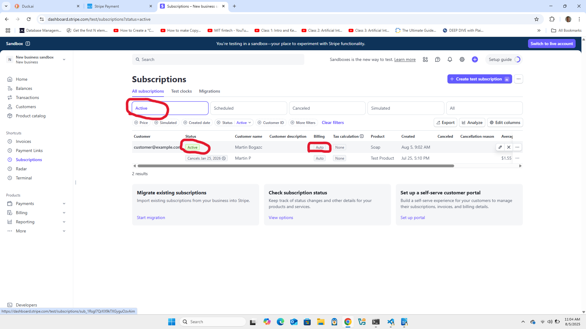

# Stripe Subscription Demo

This project demonstrates how to create a recurring **subscription-based payment flow** using Stripe. It’s built with **Flask** on the backend and uses **Stripe.js** on the frontend to securely collect card details. The goal is to understand how to integrate Stripe subscriptions end-to-end.

##  Key Concepts Covered

- Creating products and recurring pricing with Stripe
- Securely collecting payment info with Stripe Elements
- Tokenizing card data and handling it server-side
- Creating customers, attaching payment methods, and managing subscriptions

##  Project Structure

remote/  
├── create_subscription.py # Flask server handling Stripe API operations  
├── .env # Environment variables for Stripe keys  
├── templates/  
│ └── index.html # Frontend for collecting card information  
└── static/      
    └── favicon.ico # Favicon used by the HTML page 
└── assets/      
    └── project_demo.png # Demo_screenshot

    ## Preview  

Here's an example of a successfully received subscription in the Stripe Dashboard:  

How It Works
index.html fetches the publishable Stripe key and uses Stripe.js to generate a card input field.

On form submission, a token is created from the card data.

The token is sent to the backend via a POST request.

The backend:

Creates a product and recurring price

Creates a customer

Attaches the payment method

Creates a subscription

A subscription ID is returned and displayed in an alert.

 Notes
This project uses hardcoded product/customer data for learning purposes.
It is not intended for production without proper validation and error handling.

Resources  
Stripe Subscriptions Docs  
Stripe API Reference
